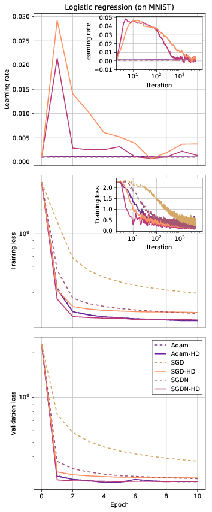
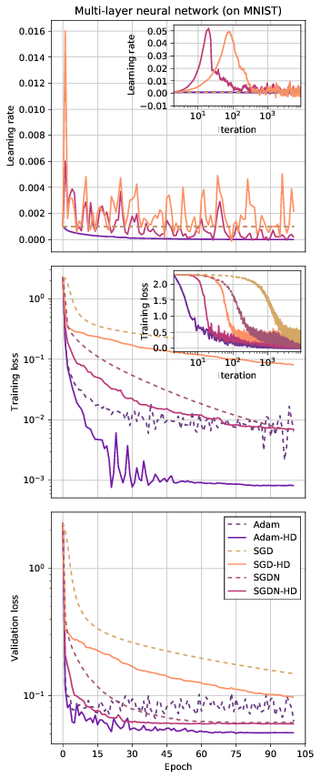
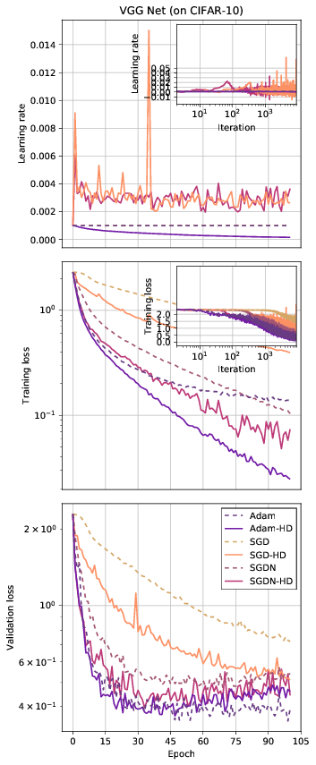

# hypergradient-descent
This is the [PyTorch](http://pytorch.org/) code for the paper [_Online Learning Rate Adaptation with Hypergradient Descent_](https://openreview.net/forum?id=BkrsAzWAb) at ICLR 2017.

A [TensorFlow](https://www.tensorflow.org/) version is also planned and should appear in this repo at a later time.

  

## What is a "hypergradient"?

In gradient-based optimization, one optimizes an objective function by using its derivatives (gradient) with respect to model parameters. In addition to this basic gradient, a _hypergradient_ is the derivative of the same objective function with respect to the optimization procedure's hyperparameters (such as the learning rate, momentum, or regularization parameters). There can be many types of hypergradients, and in this work we're interested in the hypergradient with respect to a scalar learning rate.

## How can I use it for my work?

We are providing ready-to-use implementations of the hypergradient versions of SGD (with or without momentum) and Adam optimizers for PyTorch. These comply with the `torch.optim` API and can be used as drop-in replacements in your code. Just take the `sgd_hd.py` and `adam_hd.py` files from this repo and import them like

```
from sgd_hd import SGDHD
from adam_hd import AdamHD
...

optimizer = optim.AdamHD(model.parameters(), lr=args.lr, hypergrad_lr=1e-8)
...
```

The optimizers introduce an extra argument `hypergrad_lr` which determines the hypergradient learning rate, that is, the learning rate used to optimize the regular learning rate `lr`. The value you give to `lr` sets the initial value of the regular learning rate, from which it will be adapted in an online fashion by the hypergradient descent procedure. Lower values for `hypergrad_lr` are safer because (1) the resulting updates to `lr` are smaller; and (2) one recovers the non-hypergradient version of the algorithm as `hypergrad_lr` approaches zero.

Don't be worried that, instead of having to tune just one learning rate (`lr`), now you have to tune two (`lr` and `hypergrad_lr`); just see the next section.

## What is the advantage?
Hypergradient algorithms are much less sensitive to the choice of the initial learning rate (`lr`), unlike the non-hypergradient version of the same algorithm. A hypergradient algorithm requires significantly less tuning to give performance better than, or in the worst case the same as, a non-hypergradient baseline, given a small `hypergrad_lr`, which can either be left as the recommended default or tuned. Please see the paper for guideline values of `hypergrad_lr`.

In practice, you might be surprised to see that **even starting with a zero learning rate works** and the learning rate is quickly raised to a useful non-zero level as needed, and then decayed towards zero as optimization converges:
```
optimizer = optim.AdamHD(model.parameters(), lr=0, hypergrad_lr=1e-8)
```

If you would like to monitor the evolution of the learning rate during optimization, you can monitor it with code that looks like

```
lr = optimizer.param_groups[0]['lr']
print(lr)
```

## Notes about the code in this repository
* The results in the paper were produced by code written in [(Lua)torch](http://torch.ch/). The code in this repo is a reimplementation in PyTorch, which produces results that are not exactly the same but qualitatively identical in the behavior of the learning rate, training and validation losses, and the relative performance of the algorithms.
* In the .csv result files, `nan` is used as a placeholder for empty entries in epoch losses, which are only computed once per epoch.
* The implementation in this repository doesn't include any heuristics to ensure that your gradients and hypergradients don't "explode". In practice, you might need to apply gradient clipping or safeguards for the updates to the learning rate to prevent bad behavior. If this happens in your models, we would be interested in hearing about it: please let us know via email or a GitHub issue.

## Other implementations

* A (Lua)Torch optim implementation (not the main implementation for the paper and not well-tested): https://github.com/gbaydin/optim
* An implementation of Adam-HD in C++ in the Livermore Big Artificial Neural Network Toolkit, Lawrence Livermore National Laboratory: https://github.com/LLNL/lbann/blob/a778d2b764ba209042555aac26328cbfb8063802/src/optimizers/hypergradient_adam.cpp

## Paper
Atılım Güneş Baydin, Robert Cornish, David Martı́nez Rubio, Mark Schmidt, and Frank Wood. Online learning rate adaptation with hypergradient descent. In _Sixth International
Conference on Learning Representations (ICLR), Vancouver, Canada, April 30 – May 3, 2018,_ 2018.

https://openreview.net/forum?id=BkrsAzWAb

```
@inproceedings{baydin2018hypergradient,
  title = {Online Learning Rate Adaptation with Hypergradient Descent},
  author = {Baydin, Atılım Güneş and Cornish, Robert and Rubio, David Martínez and Schmidt, Mark and Wood, Frank},
  booktitle = {Sixth International Conference on Learning Representations (ICLR), Vancouver, Canada, April 30 -- May 3, 2018},
  year = {2018}
}
```
